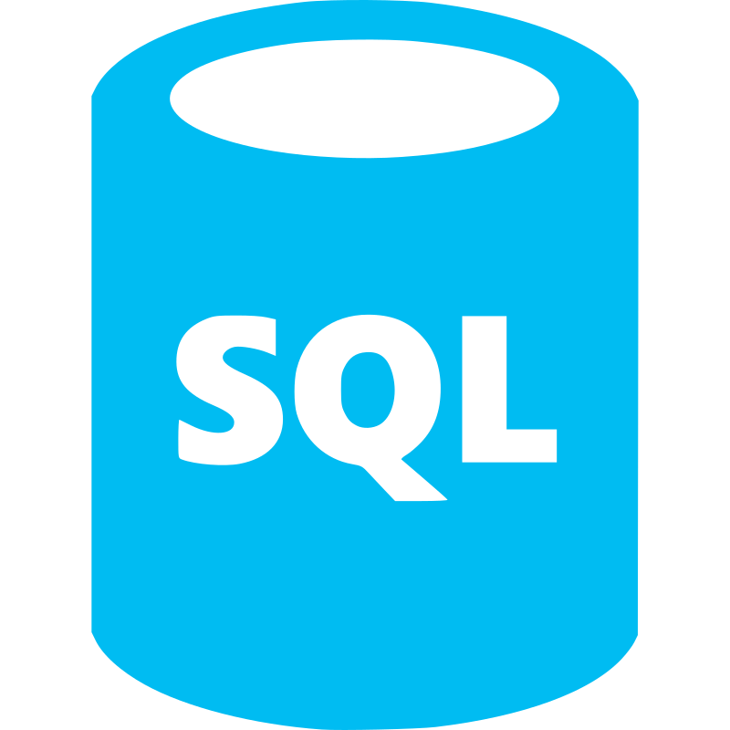

.md
<h1 align= "center">👋 Hi, I'm Akash Ahamed!</h1>

<h1>Skills</h1>
<h3 align="left"> Programming Languages:</h3>

 
  
  
  
  

<h3 align="left"> Database:</h3>

 
  

<h3 align="left"> Analytical Tools:</h3>

   
  
   

<h3 align="left"> Framework:</h3>

   

<h3 align="left"> Version Control:</h3>

   

<h3 align="left"> Project Management Tools:</h3>

   

<h1 style="color:blue;">Project</h1>

 <strong> <em>WhatsApp Chat Analyzer</em> </strong>-Statistical Analysis WebApp [ <strong>Python</strong> | <strong>Pandas</strong> | <strong>Matplotlib</strong> | <strong>Streamlit</strong> | <strong>Heroku</strong> ]
 [Link](https://duckduckgo.com)

>
>- Built a WhatsApp chat analysis web application that can analyze WhatsApp group or single chats.
>- Used **Python**, **Pandas**, **Regex**, and **Jupyter Notebook** for **data cleaning** and **transformation**. **GitHub** as a version control, 
and for data visualization **Matplotlib** was used.
>- Used **Streamlit** and **Heroku** for web application and deployment.

# Project
#### **WhatsApp Chat Analyzer**-  Statistical Analysis Tool/WebApp [**Python** | Pandas | Matplotlib | Streamlit | Heroku]

I am in LOVE!

## this a title and this should be smaller or like this
### this a title and or like this

 #### The quarterly results look great!
  >
  > - Revenue was off the chart.
  > - Profits were higher than ever.
  >
>  *Everything* is going according to **plan**.

