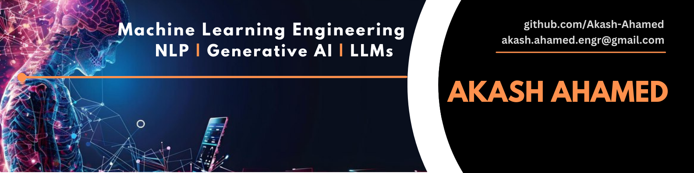

.md
<h1 align= "left">👋 Hi, I'm <strong>Akash Ahamed!</strong></h1>

<h2 align= "left">Machine Learning Engineer | NLP | Generative AI | LLMs | ChatBot | Embedding | LangChain</strong></h2>

<h4>I am passionate about machine learning and dedicated to pushing the boundaries of artificial intelligence, natural language processing, and its applications.</h4> 

<h4>I have a Bachelor of Science in Computer Science and Engineering from the University of Liberal Arts Bangladesh, where I completed a significant project on Artificial Intelligence and Machine Learning. In addition, I've worked on impactful projects, developing advanced NLP models and exploring various machine learning frameworks, libraries, generative AI, LLMs, and LangChain.</h4>

<h4>I have a strong foundation in data acquisition, data preparation, feature engineering, model building, supervised and unsupervised machine learning algorithms, natural language processing (NLP), and software development.</h4>

<h1>Skills</h1>
<h3 align="left"> Programming Languages:</h3>

 
  
  
  
  

>
>- **Python**
>- **SQL**
>- **Dart**
>- **C** 

<h3 align="left"> Database:</h3>

 
  

>
>- **MySQL**
>- **ChromaDB**
>- **Vector Database**

<h3 align="left"> Analytical Tools:</h3>

   
  
   

>
>- **Pandas**
>- **NumpPy**
>- **Scikit-Learn**
>- **Matplotlib**
>- **Regular Expression**

<h3 align="left"> Deep Learning Technologies:</h3>
<!-- 

   

 -->

>
>- **Embedding**
>- **LangChain**

<h3 align="left"> Large Language Model (LLM):</h3>
<!-- 

   

 -->

>
>- **Llama**
>- **HuggingFace**

<h3 align="left"> Machine Learning Technologies:</h3>
<!-- 

   

 -->

>
>- **Linear Regression**

<h3 align="left"> Framework:</h3>

   

>
>- **Streamlit**

<h3 align="left"> Version Control:</h3>

   

>
>- **Git**
>- **GitHub**

<h3 align="left"> Project Management Tools:</h3>

   

>
>- **Jira**

<h1 style="color:blue;">Project</h1>

 <strong> <em>WhatsApp Chat Analyzer</em> </strong>-Statistical Analysis WebApp <strong>[</strong> <strong>Python</strong> | <strong>Pandas</strong> | <strong>Matplotlib</strong> | <strong>Streamlit</strong> | <strong>Heroku</strong> <strong>]</strong> <a href="https://github.com/Akash-Ahamed/WhatsApp-Chat-Sentiment-Analysis.git">Link</a> 
 

>
>- Built a WhatsApp chat analysis web application that can analyze WhatsApp group or single chats.
>- Used **Python**, **Pandas**, **Regex**, and **Jupyter Notebook** for **data cleaning** and **transformation**. **GitHub** as a version control, 
and for data visualization **Matplotlib** was used.
>- Used **Streamlit** and **Heroku** for web application and deployment.

 <strong> <em>Cold Email Generator Tool</em> </strong>-LLMs based Cold Email Generator Tool <strong>[</strong> <strong>Python</strong> | <strong>Llama 3.1</strong> | <strong>LangChain</strong> | <strong>ChromaDB</strong> | <strong>Groq Cloud</strong> | <strong>Pandas</strong> | <strong>Streamlit</strong> <strong>]</strong> <a href="https://github.com/Akash-Ahamed/WhatsApp-Chat-Sentiment-Analysis.git">Link</a> 
 

>
>-  Built a cold email generator tool for a service company or freelancer that extracts job skills from
job posting web pages and generates personalized cold emails that include relevant portfolio links
sourced based on specific job descriptions.
>- Used **LangChain** for scraping text and LLM **Llama 3.1** for extracting job role, skills, and
description in a JSON format.
>- Used **Chromadb** as a vector database for stored portfolios and **Pandas** for data transformation.
>-  Used **Groq Cloud** for handling **Llama 3.1** LLM.
>-  Used **GitHub** as a version control, **Streamlit** for web applications, and **Python** for backend
developments.

